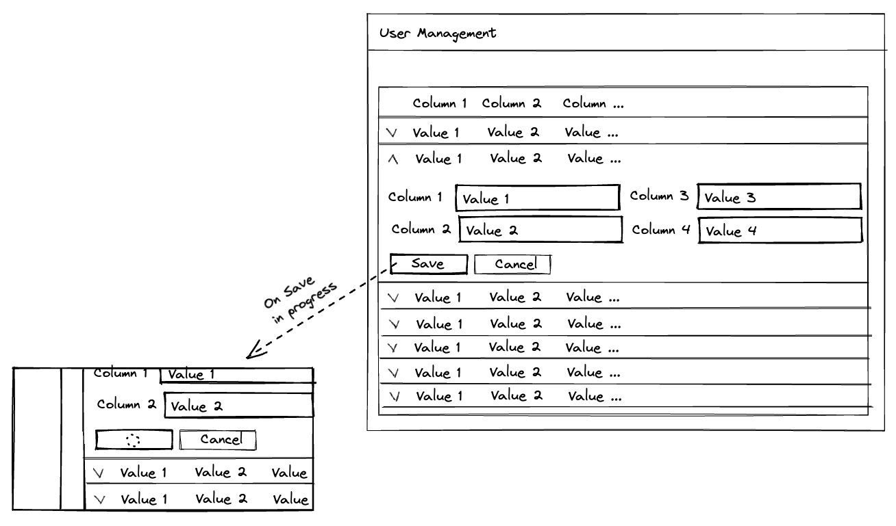

# InterviewStarter

This application is a foundation to build your app on.

It includes:
- Standalone components
- Angular Material UI
- NGRX

It is expected that all of the included features of this starter is used to build out a scalable and modular application.

The application should be type-safe and the use of type *any* is extremely discouraged.

Not all data props from the API is required.

Data only needs to be persisted to the store.

All http requests from the app should be logged to console.

## Time restrictions

You have up to 2 hours to get as much done and as best as you can. These timestamps should be reflected in your git commits between your initial and final commits.

## Product brief

This product enables the user to maintain the users data sourced from *https://dummyjson.com/users*

### Presentation
The users page should display the table of users with modification in the expandable rows as per the below wire frame. 
While saving is in progress a spinner should be shown on the save button and the buttons should be
disabled.
The table data should update automatically when new data is in the store.

When loading data, the table should gracefully handle presentation.

